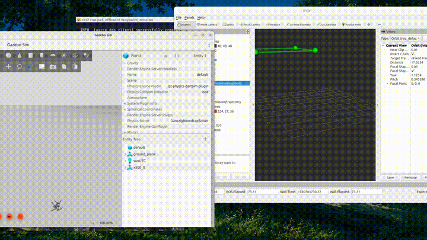
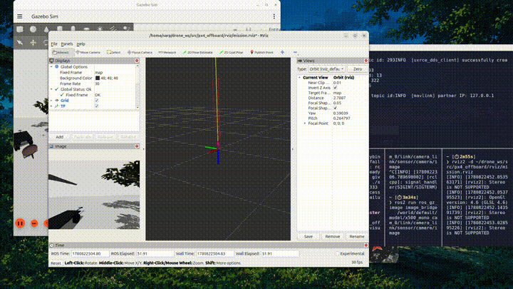
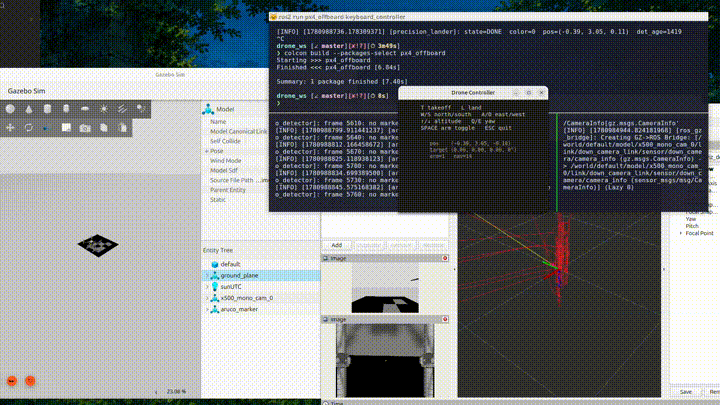
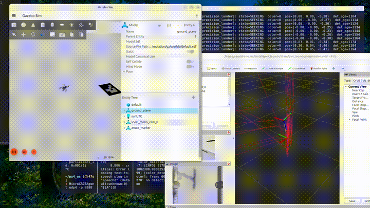
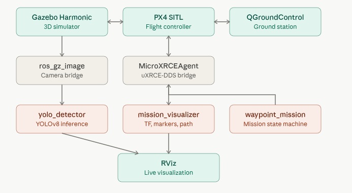

# PX4 ROS 2 Autonomous Drone

Autonomous quadcopter simulation: PX4 SITL + ROS 2 + Gazebo, with custom
offboard control, waypoint missions, and YOLOv8 perception on the camera feed.
The goal is to progressively advance the default drone, with custom waypoint planners, new add-ons etc.

## What it does

- Arms, takes off, and lands autonomously through a custom ROS 2 node
- Flies multi-waypoint missions with a state-machine planner 
- Streams the drone's camera and runs YOLOv8 object detection on every frame 
- Contains keyboard controller for custom on the fly waypoint setting or for failsafe situations where manual control is needed 
- Finds an assigned landpad (location not known beforehand) and lands on to the center, prototype model for object identification and being able to make the drone land on various different surfaces 
- Visualizes pose, waypoints, and trajectory live in RViz

Ubuntu 24.04 · ROS 2 Jazzy · Gazebo Harmonic · PX4 SITL (main) · uXRCE-DDS · YOLOv8

## Architecture

## Nodes

| Node | Role |
|---|---|
| `takeoff_and_hover` | Arm, takeoff, hover, land |
| `waypoint_mission` | State-machine waypoint navigation |
| `mission_visualizer` | RViz TF, markers, and trajectory |
| `yolo_detector` | YOLOv8 inference on the camera feed |

## Challenges
**Command latency:** Drone receives input much slower than the speed at which it is sent, causing major under and overshooting problems that had to be resolved

**landing on target:** Attempted an object detection and landing feature using color detection, however the data received from the color detector was unreliable for 
accurate center detection and landing features, after spending major time trying to debug and eventually finding a solution that worked in ideal conditions, decided to scrap idea and use Aruco detectors instead for greatly improved speed and robustness.

**Difference in convention:** Coordinate system PX4 is different than whats convention, this caused problems trying to debug why drone wasnt moving as intended, after research found the correct convention, however still had to resort to trial and error at certain points to find the correct setup that works.

**Geometric differences:** the distance recorded from camera has to be adjusted based on how far the object is. Did not know the scaling convention the camera used had and so had to work on a prediction. Not knowing whether the prediction was wrong or somewhere else in the code there was an issue, spent time debugging the wrong places until eventually finding a topic in gazebo which after bridging to ros gave k values which gave me the exact numbers that should be used in the scaling part.
